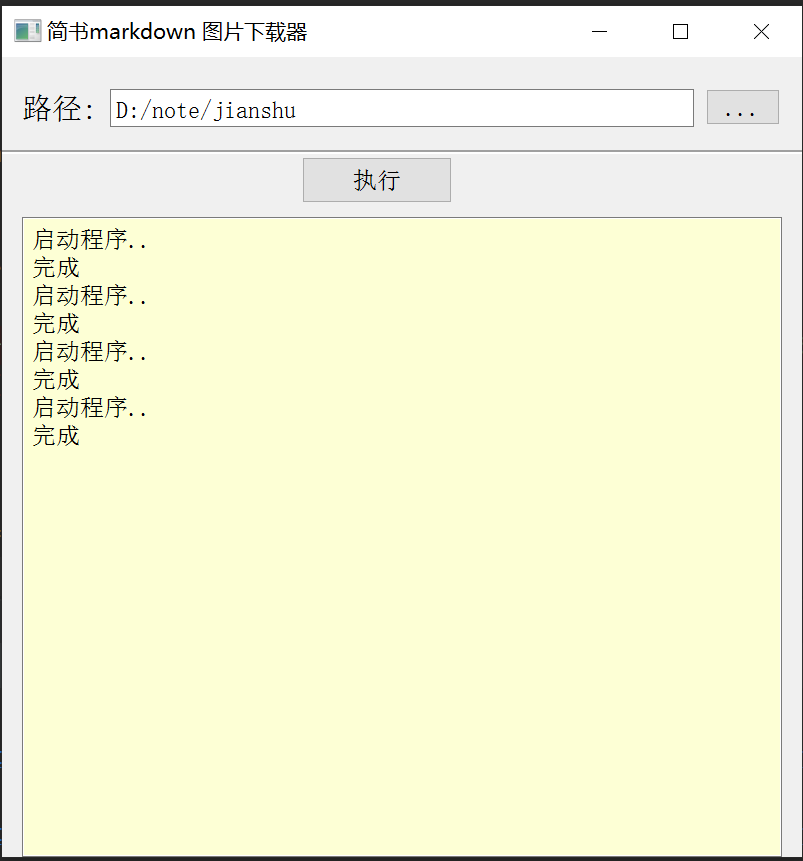

### 背景
怕简书随时关门，想把笔记全部保存到本地，以后迁移也方便。

保存下来的markdown里的图片是链接到简书服务器的，并没有链接到本地。在网上找了个程序，
发现并不是太完美，
改了下。
### fork自
[https://github.com/Deali-Axy/Markdown-Image-Parser](https://github.com/Deali-Axy/Markdown-Image-Parser)

### 运行
图片文件命名格式参照typora 文件名.assert（不带.md后缀 ）

例如：文档名为 **你好世界.md** 资源文件夹名为 **你好世界.assert**
```
pip install -r requirements.txt
python spider_new.py [目标文件夹]
```

## 欢迎与我交流
- 微信公众号：天地卜仁
- 知乎：天地卜仁

## 编译后的exe版


公众号后台回复：jianshu  获取